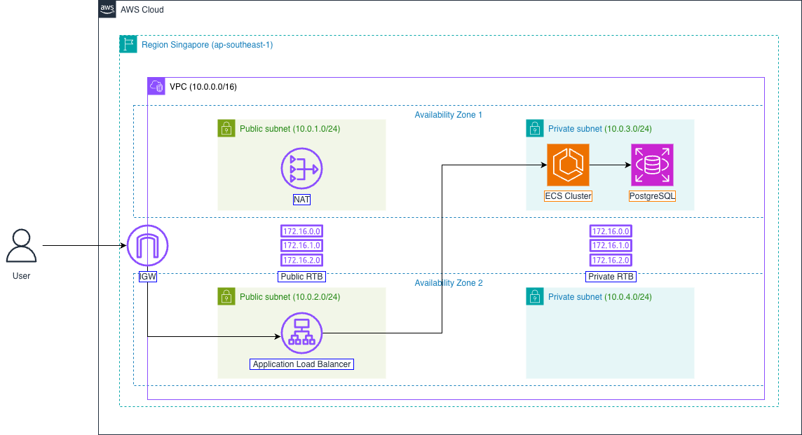
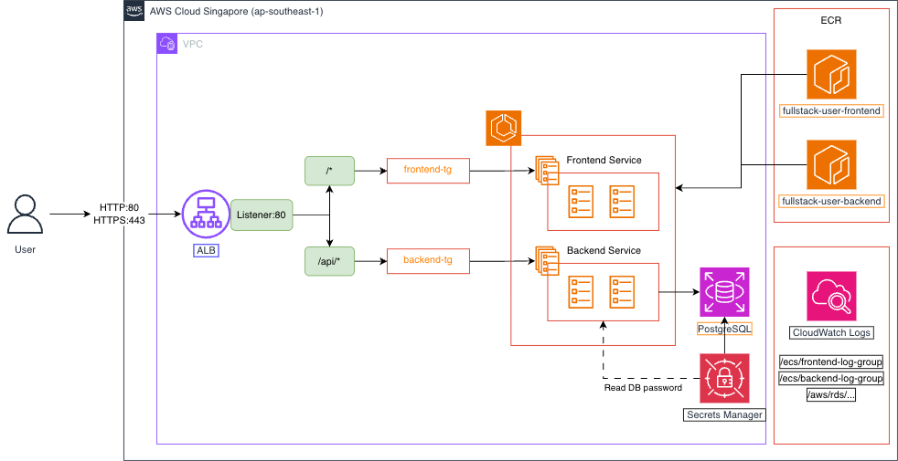
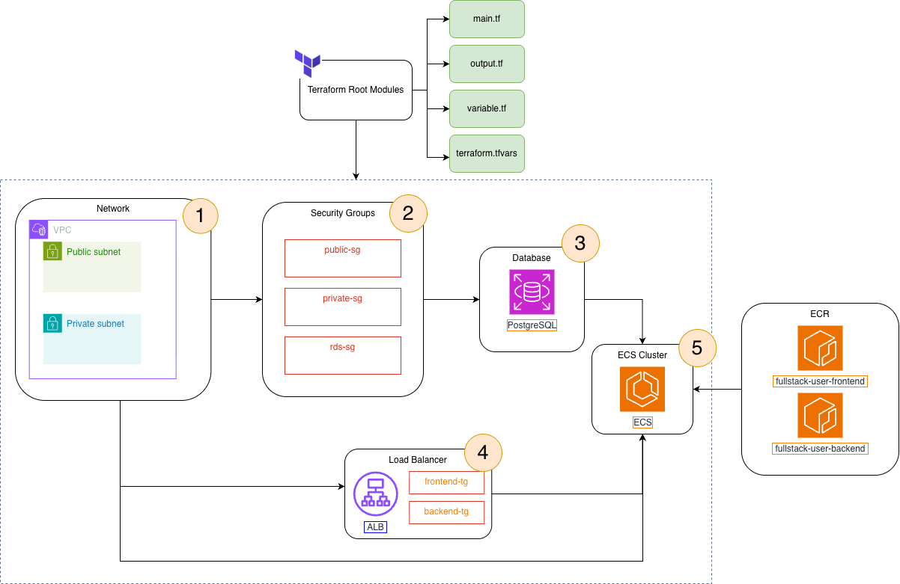
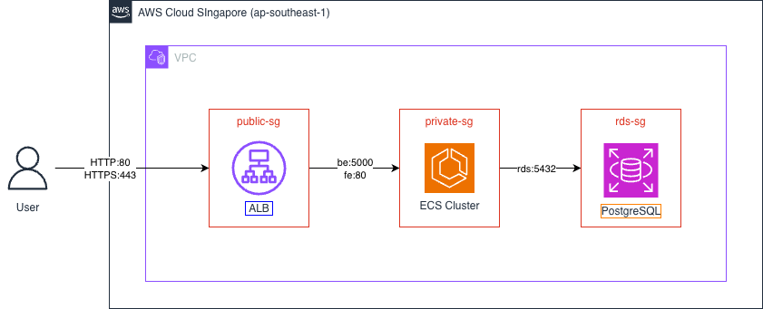

# Kiến Trúc Hệ Thống & Terraform

## Tổng Quan Kiến Trúc

### 1. AWS Networking Architecture



**Kiến trúc mạng bao gồm**:
- **VPC**: 10.0.0.0/16
- **Public Subnets**: 2 subnets (10.0.1.0/24, 10.0.2.0/24) - chứa ALB
- **Private Subnets**: 2 subnets (10.0.3.0/24, 10.0.4.0/24) - chứa ECS & RDS
- **Internet Gateway**: Cho public subnets kết nối internet
- **NAT Gateway**: Cho private subnets truy cập internet (pull images, updates)
- **Route Tables**: Phân biệt routing cho public và private subnets

### 2. AWS Services & Resources



**Services được deploy**:
- **ALB**: Load balancing với path-based routing (`/api/*` → Backend, `/*` → Frontend)
- **ECS Fargate**: Serverless container orchestration (Frontend + Backend tasks)
- **RDS PostgreSQL**: Managed database trong private subnet
- **ECR**: Private Docker registry để lưu images
- **CloudWatch**: Centralized logging & monitoring
- **Secrets Manager**: Quản lý database credentials an toàn

### 3. Terraform Module Structure



**Cấu trúc modules**:
- **singapore-dev/**: Environment-specific configuration
  - `main.tf`: Orchestration của các modules
  - `variable.tf`: Input variables
  - `output.tf`: Output values
  - `terraform.tfvars`: Variable values cho dev environment

- **modules/**: Reusable infrastructure modules
  - `vpc/`: VPC, Subnets, Internet Gateway, NAT Gateway
  - `security-groups/`: Security group rules
  - `rds/`: PostgreSQL database
  - `alb/`: Application Load Balancer & Target Groups
  - `ecs/`: ECS Cluster, Task Definitions, Services

## Chi Tiết Các Module

### Module 1: VPC (`modules/vpc`)

**Mục đích**: Tạo network infrastructure

**Resources được tạo**:
- VPC (10.0.0.0/16)
- 2 Public Subnets (10.0.1.0/24, 10.0.2.0/24)
- 2 Private Subnets (10.0.3.0/24, 10.0.4.0/24)
- Internet Gateway
- NAT Gateway (1 instance trong public subnet)
- Route Tables (public & private)

**Inputs**:
```hcl
vpc_cidr             = "10.0.0.0/16"
availability_zones   = ["ap-southeast-1a", "ap-southeast-1b"]
```

**Outputs**:
- `vpc_id`
- `public_subnet_ids`
- `private_subnet_ids`

### Module 2: Security Groups (`modules/security-groups`)

**Mục đích**: Quản lý firewall rules



**Security Groups**:

1. **Public SG** (cho ALB):
   - Inbound: Port 80 (HTTP) từ 0.0.0.0/0
   - Outbound: All traffic

2. **Private SG** (cho ECS):
   - Inbound: Port 80 từ Public SG (để ALB forward traffic)
   - Outbound: All traffic

3. **RDS SG** (cho Database):
   - Inbound: Port 5432 từ Private SG (chỉ ECS mới access được)
   - Outbound: All traffic

### Module 3: RDS (`modules/rds`)

**Mục đích**: PostgreSQL database

**Resources**:
- DB Subnet Group
- RDS PostgreSQL 14.10 (db.t3.micro)
- Secrets Manager (database password)

**Configuration**:
```hcl
engine                = "postgres"
engine_version        = "14.10"
instance_class        = "db.t3.micro"
allocated_storage     = 20
database_name         = "fullstack_user"
master_username       = "postgres"
multi_az              = false
publicly_accessible   = false
```

**Outputs**:
- `db_endpoint`
- `db_name`
- `db_username`
- `secret_arn` (password trong Secrets Manager)

### Module 4: ALB (`modules/alb`)

**Mục đích**: Load balancing & routing

**Resources**:
- Application Load Balancer
- Frontend Target Group (port 8080)
- Backend Target Group (port 5000)
- HTTP Listener với path-based routing

**Routing Rules**:
```
Priority 1: /api/*  → Backend Target Group (port 5000)
Default:    /*      → Frontend Target Group (port 8080)
```

**Health Checks**:
- Frontend: `GET /` (interval: 30s)
- Backend: `GET /api/users` (interval: 30s)

### Module 5: ECS (`modules/ecs`)

**Mục đích**: Container orchestration

**Resources**:
- ECS Cluster
- Task Execution Role (pull images, logs)
- Task Role (access AWS services)
- CloudWatch Log Groups
- Task Definitions (Frontend & Backend)
- ECS Services

**Frontend Task Definition**:
```hcl
CPU:    256 (0.25 vCPU)
Memory: 512 MB
Image:  <ecr-url>/fullstack-user-frontend:latest
Port:   8080
```

**Backend Task Definition**:
```hcl
CPU:    512 (0.5 vCPU)
Memory: 1024 MB
Image:  <ecr-url>/fullstack-user-backend:latest
Port:   5000
Environment Variables:
  - DB_HOST: <rds-endpoint>
  - DB_NAME: fullstack_user
  - DB_USERNAME: postgres
Secrets:
  - DB_PASSWORD: từ Secrets Manager
```

**ECS Services**:
- Desired count: 1 task mỗi service
- Launch type: FARGATE
- Auto-attach to Target Groups

## Chi Phí Resources

| Resource | Type | Chi Phí/Tháng |
|----------|------|---------------|
| NAT Gateway | Single AZ | ~$32 |
| ALB | Standard | ~$16 |
| ECS Fargate | 2 tasks (0.75 vCPU, 1.5GB) | ~$30 |
| RDS | db.t3.micro | ~$15 |
| CloudWatch Logs | 5GB | ~$2.5 |
| Secrets Manager | 1 secret | ~$0.4 |
| **Total** | | **~$96/month** |
