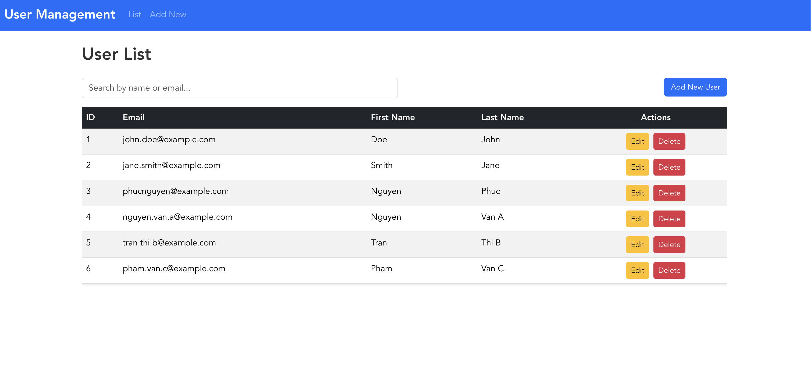

# Fullstack User Management Application

Ứng dụng quản lý user fullstack áp dụng quy trình DevOps, CI/CD pipeline, và AWS cloud deployment.



---

## 📚 Mục Lục

- [OVERVIEW.md](OVERVIEW.md) - Giới thiệu dự án, công nghệ, workflow
- [ARCHITECTURE.md](ARCHITECTURE.md) - Kiến trúc AWS, Terraform modules, networking
- [CI-CD.md](CI-CD.md) - Setup Jenkins, configure pipeline, webhooks
- [MONITORING.md](MONITORING.md) - CloudWatch logs, metrics, dashboards, alarms
- [LESSIONS.md](LESSONS.md) - Bài học kinh nghiệm và kỹ năng đạt được từ dự án

---

## 🚀 Quick Start

### Prerequisites
```bash
- Docker & Docker Compose
- Node.js 16+ (cho local dev)
- .NET 6 SDK (cho local dev)
```

### Chạy Ứng Dụng với Docker Compose

```bash
# Clone repository
git clone https://github.com/nhphuc98/fullstack-user.git
cd fullstack-user

# Start tất cả services
docker-compose up -d
```

### Truy Cập Ứng Dụng

| Service | URL |
|---------|-----|
| **Frontend** | http://localhost:8080 |
| **Backend API** | http://localhost:5001/api/users |
| **Swagger UI** | http://localhost:5001/swagger |

---

**Project completed:** December 2025 - **Author:** Nguyen Hoang Phuc
